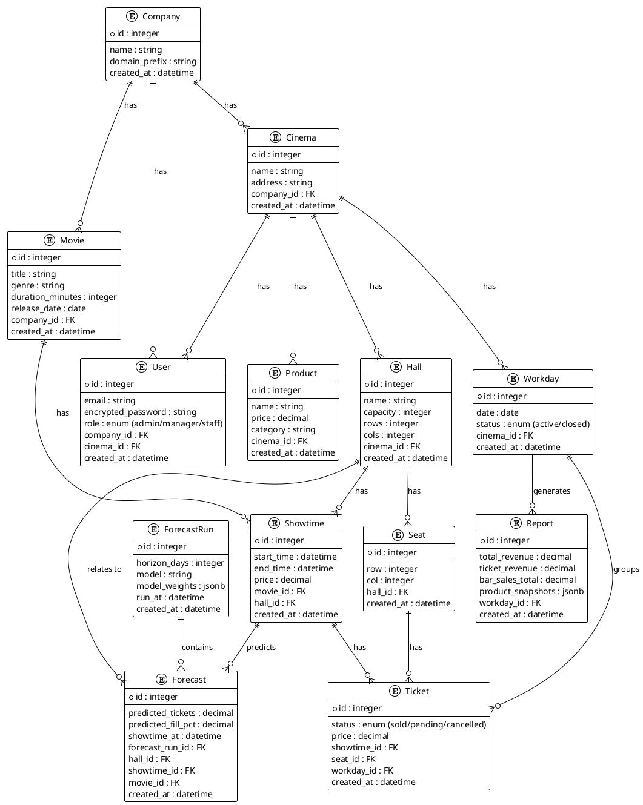
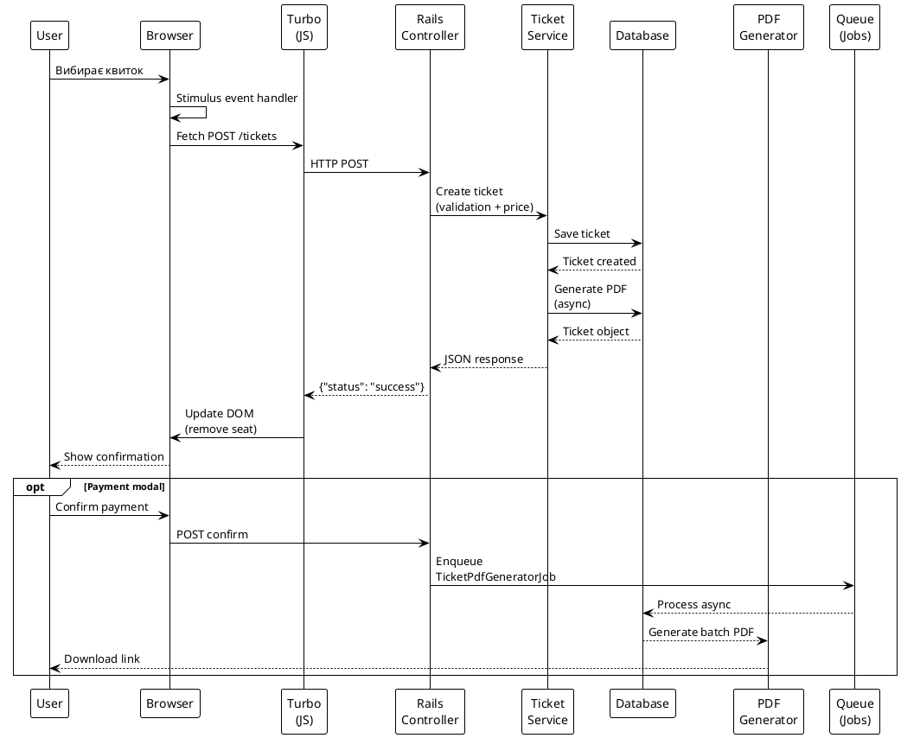
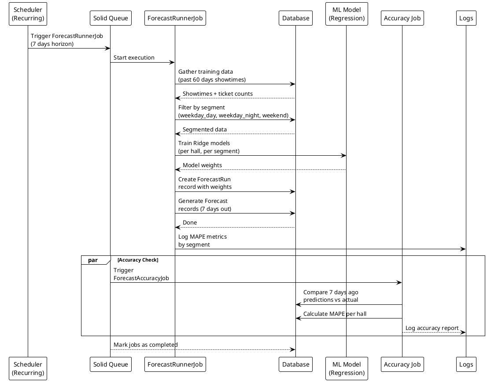
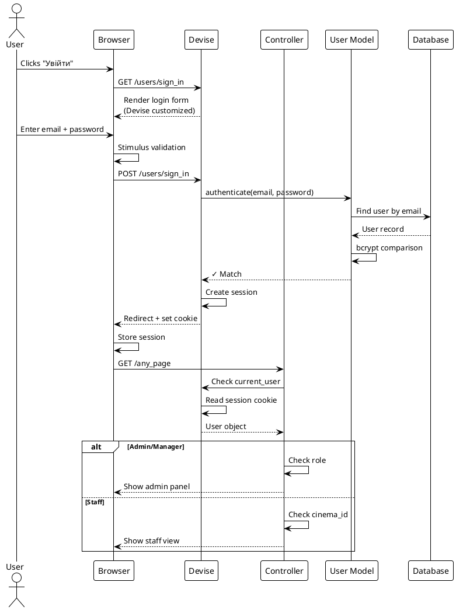

# PlantUML Діаграми для My D App

## 1. Архітектура системи (Component + Communication)

```plantuml
@startuml My_D_App_Architecture

!theme plain

package "Frontend Layer" {
  actor User
  component "Browser" as browser {
    component "ERB Views (53 files)" as views
    component "Turbo Rails" as turbo
    component "Stimulus Controllers" as stimulus
    component "Tailwind CSS" as tailwind
  }
}

package "Backend Layer" {
  component "Rails 8.1" as rails {
    component "Routes (RESTful)" as routes
    component "11 Controllers" as controllers
    component "Devise Auth" as devise
    component "4 Services" as services {
      component "BatchShowtimeCreator" as batch
      component "RegressionTrainer" as trainer
      component "ReportPdfGenerator" as pdf_report
      component "TicketPdfGenerator" as pdf_ticket
    }
  }
}

package "Data Layer" {
  database "SQLite3" as db {
    component "14 Models" as models {
      note right of models
        • Company, Cinema
        • User (with roles)
        • Movie, Hall, Seat
        • Showtime, Ticket
        • Product, Workday
        • Report, Forecast
        • ForecastRun
      end note
    }
  }
  component "Active Storage" as storage
}

package "Async Processing" {
  component "Solid Queue" as queue {
    component "Job Scheduler" as scheduler
    component "ForecastRunnerJob" as f_runner
    component "ForecastAccuracyJob" as f_accuracy
    component "Recurring Tasks" as recurring
  }
}

package "Infrastructure" {
  component "Solid Cache" as cache
  component "Solid Cable (WebSocket)" as cable
  component "Puma Web Server" as puma
}

' Relationships
User -->|Clicks| browser
browser -->|Render| views
views -->|Fetch API\n(async/await)| routes
routes -->|JSON/HTML| browser
browser -->|Turbo| turbo
turbo -->|Update DOM| views

routes -->|CRUD Ops| models
routes -->|Auth Check| devise
routes -->|Business Logic| services
services -->|Read/Write| models

models -->|Persist| db
db -->|Queries| controllers

routes -->|Enqueue| queue
queue -->|Schedule| scheduler
f_runner -->|Process| models
f_accuracy -->|Analyze| models
recurring -->|Trigger| queue

services -->|Store| storage
routes -->|Cache| cache

puma -->|Serve| rails

@enduml
```

---

## 2. Entity Relationship Diagram (ERD - Дані та їх зв'язки)



---

## 3. Послідовність операцій - Продаж квитка



---

## 4. Послідовність операцій - Генерація прогнозів



---

## 5. Потік аутентифікації та авторизації



---

## Як використовувати ці діаграми

### Варіант 1: Online Editor
1. Перейти на https://www.plantuml.com/plantuml/uml/
2. Скопіювати весь вміст однієї з діаграм (від @startuml до @enduml)
3. Вставити в редактор
4. Натиснути "Render"

### Варіант 2: VS Code
1. Встановити розширення "PlantUML"
2. Створити файл `diagram.puml` 
3. Вставити вміст
4. Right-click → "PlantUML: Preview"

### Варіант 3: Локально (CLI)
```bash
brew install plantuml  # або apt-get на Linux
plantuml diagram.puml
# Створить diagram.png
```

---

## Рекомендація

**Найкраще почати з діаграми #1 (Architecture)** - вона дає найбільш повну картину системи.

Потім **#2 (ERD)** - щоб розуміти структуру даних.

А **#3, #4, #5** - для вивчення конкретних бізнес-потоків.
